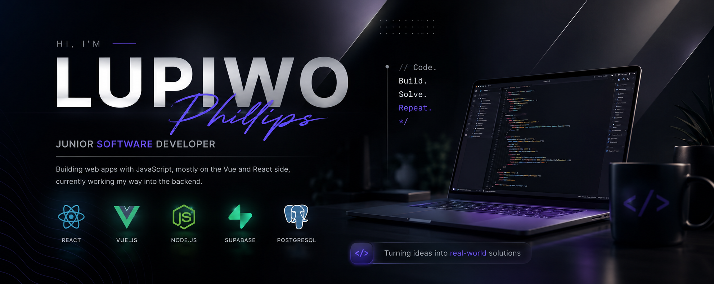

Junior developer building web apps with JavaScript, mostly on the Vue and React side, currently expanding into backend development.

I like taking an idea, building it end to end, and figuring out what breaks along the way.

---

## Currently building

### LifeOS

A personal operating system designed to help people understand and improve different areas of their lives.

LifeOS brings together daily check-ins, habits, goals, journaling, life areas, streaks, and personal insights into one application — turning everyday actions into a clearer picture of personal progress.

**Status:** 🧪 Active development • Testing & bug fixing

**Tech:** React • JavaScript • Supabase • PostgreSQL • REST APIs

**Links:** [Repository](https://github.com/LupiwoPhillips/LifeOS_TestingPhase.git)

LifeOS is open source and welcomes feedback, bug reports, ideas, and community contributions.

---

## Some things I've built

### ISeeCrime

A crime mapping and information platform focused on making crime-related information more accessible and easier to understand.

**Tech:** React • JavaScript • APIs • Mapbox • Supabase

**Links:** [Repository](https://github.com/LupiwoPhillips/my-crime-app.git)

---

### Personal Finance Dashboard

A full-featured finance tracker with real authentication, budgets, alert thresholds, recurring transactions, investment tracking, and CSV/PDF export.

**Tech:** Vue 3 • Pinia • Tailwind CSS • Supabase • PostgreSQL • Chart.js

**Links:** [Repository](https://github.com/LupiwoPhillips/personal-finance-dashbaord.git)

---

### EventSphere

An event discovery and management web application integrating external event data with a modern frontend experience.

**Tech:** Vue 3 • Vite • JavaScript • Supabase • REST APIs

**Links:** [Repository](https://github.com/LupiwoPhillips/EventSphere.git)

---

### Velora

A web application built to demonstrate modern frontend development, application structure, and user-focused interface design.

**Tech:** React • JavaScript • Vite

**Links:** [Repository](https://github.com/LupiwoPhillips/Velora.git)

---

## Currently learning

* Backend development with Node.js and Express
* SQL and database development with Supabase
* API design and authentication
* Database design
* Deployment and production workflows
* Testing, debugging, and maintaining real-world applications
* Open-source development and collaboration

---

## Tech stack

### Frontend

### Backend

### Data / Services

### Tools

---

## Connect

---

## Open Source & Licensing

**LifeOS** is an open-source project released under the **MIT License**.

The project is currently in active testing and development. Feedback, bug reports, feature suggestions, and community contributions are welcome.

For contribution guidelines, see the `CONTRIBUTING.md` file in the LifeOS repository.

Other repositories on this profile are personal projects and portfolio work and may have different licensing terms.

See the `LICENSE` file in each repository for the specific terms applicable to that project.
